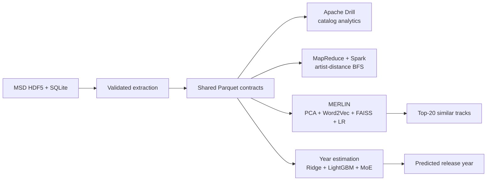

<div align="center">

# MSD Intelligence

**Million-song-scale analytics, graph intelligence, recommendation, and year estimation.**

[](CHANGELOG.md)
[](LICENSE)
[](https://deepwiki.com/EggHeadYao/msd-intelligence)

[](http://millionsongdataset.com)
[](#architecture)
[](#merlin-similar-track-recommendation)

[Slides](slides.pdf) | [Poster](poster.pdf) | [Changelog](CHANGELOG.md)

</div>

The [Million Song Dataset (MSD)](http://millionsongdataset.com) is a research collection of derived audio features and metadata for one million contemporary popular music tracks, created through a collaboration between The Echo Nest and Columbia University's LabROSA. It contains no audio recordings.

MSD Intelligence converts the source HDF5, SQLite, and auxiliary files into a shared, contract-driven Parquet foundation and builds four systems on top of it: SQL analytics with Apache Drill, distributed shortest paths with Hadoop and Spark, MERLIN catalog-level similar-track recommendation, and artist-disjoint release-year estimation.

The repository is designed as an end-to-end data and ML systems project rather than a collection of isolated notebooks. Its ML pipelines persist ordered schemas, hashes, seeds, lineage, validation reports, and stable row mappings so that large external artifacts can be rebuilt and checked stage by stage.

## Highlights

| System | Scale and method | Recorded result |
| --- | --- | --- |
| **Apache Drill analytics** | Four deterministic SQL queries over Parquet | All four query outputs are published and independently inspectable |
| **Artist distance** | Directed BFS with MapReduce/Spark over Avro/Parquet | Spark is **14.07x-14.44x faster** than MapReduce by median wall time; all 20 formal runs passed the reference verifier |
| **MERLIN graph retrieval** | 10M typed walks, Spark Word2Vec, normalized 128D vectors, exact FAISS search | Masked-artist **Recall@20 = 0.5861** and **nDCG@20 = 0.6431**, versus 0.4305 and 0.4984 for release-only retrieval |
| **Year prediction** | Artist-disjoint Ridge, RFF-Ridge, LightGBM, Ordinal-MoE, and model fusion | Validation-fitted linear ensemble of three LightGBM predictors: **MAE = 4.8195 years**, **RMSE = 7.2405 years** |

The Ridge batching study additionally reduced total training time by about **23%** with 10% and 25% sampled updates while keeping test quality effectively unchanged.

## Architecture



## Systems

### Apache Drill analytics

The Drill module exposes the selected Parquet directory through a portable read-only workspace and runs four deterministic queries: valid release-year range, lexicographic extreme song, album with the most distinct tracks, and artist with the longest track.

- Queries and execution: [`src/drill/`](src/drill/README.md)
- Published outputs: [`src/drill/results/`](src/drill/results/)

### Distributed artist distance

The artist graph preserves the direction of `artist_similarity.db`. A shared level-synchronous BFS contract is implemented in four combinations: MapReduce/Avro, MapReduce/Parquet, Spark/Avro, and Spark/Parquet. Every benchmark output is compared with an independent reference BFS before it is accepted.

- Implementation: [`src/artistdistance/`](src/artistdistance/)
- Benchmark protocol: [`src/artistdistance/benchmark/`](src/artistdistance/benchmark/README.md)
- Results: [`src/artistdistance/experiments/`](src/artistdistance/experiments/README.md)

### MERLIN similar-track recommendation

MERLIN is a non-personalized, multi-view retrieval and ranking pipeline:

1. **C1 Audio** fits a 128D PCA encoder over cleaned global and segment-level audio summaries and builds an exact cosine FAISS index.
2. **C2 Graph** generates deterministic typed meta-path walks over track, artist, release, and term relations, trains Spark Word2Vec, and builds an independent graph index.
3. **C3 Fusion** combines Audio, Graph, artist-distance BFS, and Tag candidates, computes canonical pair features, and uses a frozen relation-evidence gate to choose between C1 order and an LR/C1 quota interleave for Top-20 selection.

- Prepared contracts: [`src/merlin/prepare/`](src/merlin/prepare/README.md)
- Audio representation: [`src/merlin/embedding/audio/`](src/merlin/embedding/audio/README.md)
- Graph representation and masked evaluation: [`src/merlin/embedding/graph/`](src/merlin/embedding/graph/README.md)
- Ranking and inference: [`src/merlin/inference/`](src/merlin/inference/README.md)

### Artist-disjoint year prediction

The year pipeline separates artists across train, validation, and test splits, then evaluates increasingly expressive models under one feature and metric contract. It moves from constant and custom Spark SGD Ridge baselines through RFF-Ridge, LightGBM, and Ordinal-MoE to audio/metadata fusion and a validation-fitted prediction ensemble. The final ensemble is an ordinary least-squares combination of frozen audio-only, metadata-only, and fused LightGBM predictions.

- Dataset contracts: [`src/year_prediction/src/data/`](src/year_prediction/src/data/README.md)
- Feature views: [`src/year_prediction/src/features/`](src/year_prediction/src/features/README.md)
- Distributed training: [`src/year_prediction/src/training/`](src/year_prediction/src/training/README.md)
- Model comparison: [`src/year_prediction/experiments/model_comparison/`](src/year_prediction/experiments/model_comparison/README.md)
- Ridge batching study: [`src/year_prediction/experiments/ridge_batching/`](src/year_prediction/experiments/ridge_batching/README.md)

## Repository layout

```text
msd-intelligence/
├── tools/hdf5/                  HDF5 and SQLite extraction utilities
├── src/drill/                   Apache Drill queries and verified results
├── src/artistdistance/          Java BFS, converters, validators, and YARN benchmarks
├── src/merlin/                  Preparation, embeddings, retrieval, ranking, and inference
├── src/year_prediction/         Data, features, models, tests, and experiment reports
├── src/slides/                  Reproducible presentation sources and figures
├── src/poster/                  Reproducible poster sources and artwork
├── slides.pdf                   Prebuilt project presentation
└── poster.pdf                   Prebuilt investment poster
```

## Getting started

Clone the repository with Git LFS enabled so the presentation assets are materialized:

```bash
git lfs install
git clone https://github.com/EggHeadYao/msd-intelligence.git
cd msd-intelligence
git lfs pull
```

The source Million Song Dataset, generated Parquet tables, FAISS indexes, and full model artifacts are intentionally not committed. Consult the MSD project's [official data-access guidance](http://millionsongdataset.com/pages/getting-dataset), obtain the dataset through an authorized source, and provide explicit input/output paths to the selected stage. Start with the extraction contract in [`tools/hdf5/README.md`](tools/hdf5/README.md).

There is intentionally no universal one-command build: extraction, distributed graph processing, recommendation training, and year estimation have different runtime and storage requirements. Each stage documents its own fail-closed inputs, outputs, and validation command.

### Common entry points

Run the Drill queries against an existing Year Prediction raw-data directory:

```bash
./src/drill/scripts/run_all.sh /absolute/path/to/year_prediction/raw
```

Build the artist-distance module and run five repetitions of all four combinations:

```bash
cd src/artistdistance
mvn -q package dependency:copy-dependencies -DincludeScope=runtime
ARTIST_SIMILARITY_DB=/absolute/path/to/artist_similarity.db \
  ./benchmark/run_experiment.sh 5
```

Run the top-level Year Prediction Ridge oracle checks from the repository root:

```bash
python3 -m unittest discover -s src/year_prediction/tests -p 'test_*.py'
```

Additional feature, training, evaluation, and integration tests are organized under [`src/year_prediction/tests/`](src/year_prediction/tests/README.md). Spark worker tests require PyArrow in the worker environment; SynapseML integration tests additionally require the Python package and matching JVM jars documented in the [LightGBM training guide](src/year_prediction/src/training/lightgbm/README.md).

Build the presentation artifacts:

```bash
make -C src/slides
make -C src/poster
```

## Runtime requirements

The project deliberately preserves the tested runtime of each subsystem instead of forcing incompatible stacks into one environment.

| Subsystem | Tested stack |
| --- | --- |
| Extraction | Python 3, NumPy, h5py, PyArrow |
| Drill | Apache Drill 1.22.0 |
| Artist distance | Java 17, Maven, Hadoop 3.5.0, Spark 4.1.2, Scala 2.13 |
| MERLIN | Python 3, Spark, NumPy, PyArrow, FAISS |
| Year Prediction LightGBM | Java 17, Spark 3.5.x/Scala 2.12, PySpark 3.5.5, SynapseML 1.1.3 |
| Slides and poster | LaTeX, `latexmk` |

ARM64 LightGBM requires the pinned native libraries described in the [LightGBM training guide](src/year_prediction/src/training/lightgbm/README.md). The two Spark generations should be kept in separate environments.

## Contributors

- [Jiang Ruiyu](https://github.com/YUcxovo)
- [Li Zhiyuan](https://github.com/Willmathss)
- [Yao Yunxiang](https://github.com/EggHeadYao)
- [Zhang Jingkai](https://github.com/Cammy107)

## License

This project is released under the [MIT License](LICENSE).
