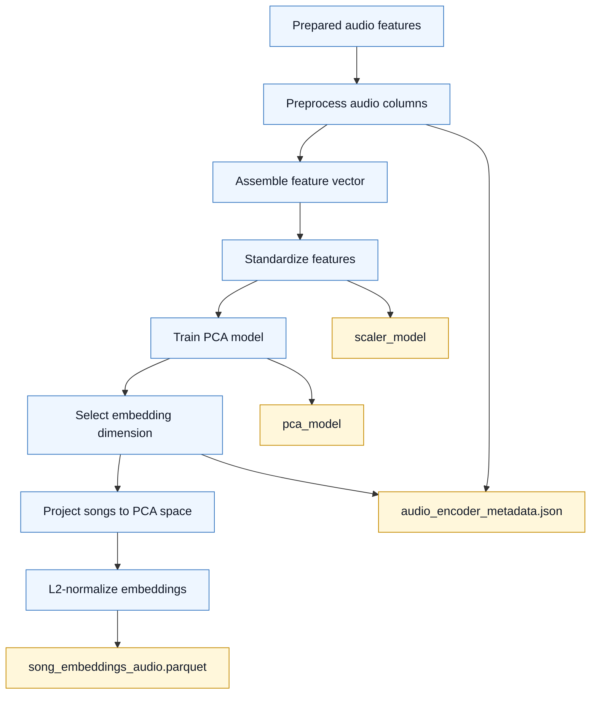

# Audio PCA Training Flow

- Read the prepared audio feature table.
- Preprocess raw audio fields into numeric model features.
- Assemble and standardize the feature vector.
- Train PCA and select the final embedding dimension.
- Project each song, normalize the embedding, and write the embedding table.
- Save the scaler, PCA model, and encoder metadata for reproducibility.
